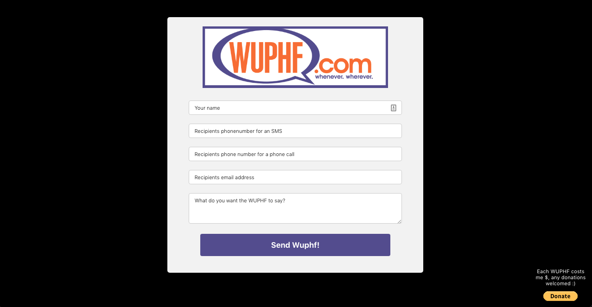

# WUPHF.com



## Running Locally

### You must add a secrets.yaml file to the config/ folder with the following:

```yaml
twilio:
  account_sid: <TWILIO SID>
  auth_token: <TWILIO AUTH TOKEN>
  phone_number: <TWILIO PHONE NUMBER>

gmail:
  email: <EMAIL ADDRESS>
  password: <PASSWORD>
```

### You'll also need a TwIML template for the phone call. The app is set to use the `from_name` and `message` variables and replace them with what's inputted by the user.

#### These can be created here https://www.twilio.com/console/twiml-bins

```xml
<?xml version="1.0" encoding="UTF-8"?>
<Response>
<Say>
Woof from {{from_name}}, {{message}}.
</Say>
</Response>
```
